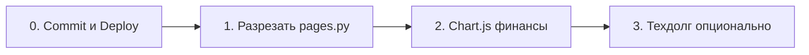

# План работ для субагентов

**Обновлено:** 04.06.2026  
**Как пользоваться:** копируй блок «Промпт субагенту» целиком в отдельный чат/агента. Один шаг = один запуск. После каждого шага: `pytest tests/` → commit → deploy по [NPM_PROXY.md](./NPM_PROXY.md).

---

## Отменено (не делать)

| Было в ROADMAP | Причина |
|----------------|---------|
| Экспорт PDF / milestone | Достаточно `.md` на `/stats` (`/api/career/export`) |
| Топ-3 достижения на дашборде | Не нужно |
| Излишек месяца → фин. цели | Не релевантно |
| Напоминания бота 15/30 мин | Не релевантно |
| Inline mode `@bot` | Вне scope (не запрашивалось) |

---

## Очередь (порядок важен)



---

## Шаг 0 — Commit + Deploy на VPS

**Цель:** Выкатить уже написанный код (auth, cookie, recurring_schedule, NPM, docs).

**Готово в репо, но может быть не на сервере:**
- `app/auth.py`, `app/middleware/`, `app/web/auth_routes.py`, `login.html`
- `app/services/recurring_schedule.py`
- `docker-compose.yml` (без `:8000` наружу)
- `docs/AUTH.md`, `docs/NPM_PROXY.md`, обновлённые HANDOVER/README/ROADMAP

**Чеклист VPS:**
1. `git pull` на `/opt/projects/planner`
2. `.env`: `API_TOKEN`, `TELEGRAM_ADMIN_CHAT_ID`
3. `docker compose up -d --build` + `docker image prune -f`
4. NPM: Forward `task_planner:8000`, SSL
5. Открыть `https://домен/login`, проверить дашборд
6. `docker exec task_planner curl -s http://127.0.0.1:8000/api/health`
7. Снаружи `:8000` закрыт

**Критерий готовности:** вход по cookie, бот и задачи на месте, 95 тестов уже в репо.

### Промпт субагенту

```
Задача: задеплоить текущий main ветки plan на VPS по docs/NPM_PROXY.md и docs/AUTH.md.
Не менять код, только: проверить uncommitted changes, при необходимости помочь с commit message,
пошагово SSH/deploy, проверить health и /login.
Путь на сервере: /opt/projects/planner, IP 91.186.217.66.
```

---

## Шаг 1 — Разрезать `app/web/pages.py` (бывший «шаг C»)

**Цель:** Монолит ~2200 строк → модули по доменам без изменения поведения.

**Предлагаемая структура:**

```
app/web/
  pages.py          # только router + include_sub_routers
  routes/
    dashboard.py
    tasks.py
    backlog.py
    calendar.py
    recurring.py
    categories.py
    stats.py
    finance.py
    shopping.py
    career.py       # impacts, export
  templates/        # без изменений
  deps.py           # templates, shared helpers (get_today_stats, …)
```

**Правила:**
- URL и имена роутов **не менять**
- Общие хелперы вынести в `deps.py` или `app/web/helpers.py`
- `app/main.py`: `from app.web.pages import router` оставить рабочим
- После рефактора: `pytest tests/` — все 95 green

**Критерий готовности:** нет регрессий HTMX/API; `pages.py` < 100 строк (только сборка роутеров).

### Промпт субагенту

```
Рефакторинг app/web/pages.py: разбить на app/web/routes/*.py по доменам.
Сохранить все URL и поведение HTMX. Вынести общие хелперы в app/web/deps.py.
Не трогать бизнес-логику recurring — она в app/services/recurring_schedule.py.
Обязательно: pytest tests/ — 95 passed. Минимальный diff по смыслу, без новых фич.
```

---

## Шаг 2 — Chart.js: расходы по категориям на `/finance`

**Цель:** Круговая диаграмма долей расходов за выбранный месяц.

**Контекст:**
- Данные уже считаются в `finance_page` → `category_summary` (имя категории, сумма)
- Шаблон: `app/web/templates/finance.html`
- Только **расходы** (`amount > 0` по текущей логике финансов)

**Сделать:**
1. Подключить Chart.js (CDN в `finance.html` или `base` только для finance)
2. Partial или блок в шаблоне: canvas + JSON/data-атрибуты из backend
3. Легенда с суммами и %; пустой месяц — заглушка «Нет расходов»
4. Стили в духе dark theme (как дашборд)
5. Тест: `tests/test_finance.py` или новый — страница рендерится, в HTML есть canvas/chart data

**Не делать:** излишек → цели, новые API без нужды.

**Критерий готовности:** на `/finance` при смене месяца таблица + круговая диаграмма согласованы.

### Промпт субагенту

```
Добавить круговую диаграмму Chart.js на страницу /finance: расходы по категориям
за выбранный месяц. Использовать category_summary из finance_page в app/web/...
(после шага 1 путь может быть app/web/routes/finance.py).
Dark UI, CDN Chart.js. Пустой месяц — friendly empty state.
Добавить/обновить pytest. Не трогать financial_goals логику пополнения.
pytest tests/ должен проходить.
```

---

## Шаг 3 — Техдолг (опционально, низкий приоритет)

Делать **только если** попросишь отдельно.

### 3a. Alembic вместо `ALTER … except: pass`

- Ввести Alembic, baseline из текущей схемы
- Новые колонки — только миграциями
- `init_db` упростить

### 3b. Бэкап SQLite

- `backup_service.py`: `sqlite3.backup` или VACUUM INTO вместо `shutil.copy2` на живой WAL

### Промпт субагенту (3a)

```
В проекте plan внедри Alembic для SQLite. Baseline миграция по текущим моделям.
Убери silent ALTER из app/db/database.py для новых изменений (старые можно оставить один раз).
Документируй в HANDOVER. pytest tests/ green.
```

---

## Справка: что уже сделано (не поручать субагентам)

- [x] Auth API_TOKEN + middleware + `/login` cookie
- [x] NPM docs, порт 8000 закрыт
- [x] `recurring_schedule.py`
- [x] n8n удалён
- [x] 95 тестов, docs обновлены

---

## Шаблон запроса к субагенту (универсальный)

```
Проект: /Users/vera/Desktop/личные_доки/СLI/plan
Выполни только «Шаг N» из docs/SUBAGENT_PLAN.md.
Правила: pytest tests/ в конце; не расширять scope; русский commit message по желанию Vera.
Не коммитить .env. После кода — краткий чеклист проверки для Vera.
```
