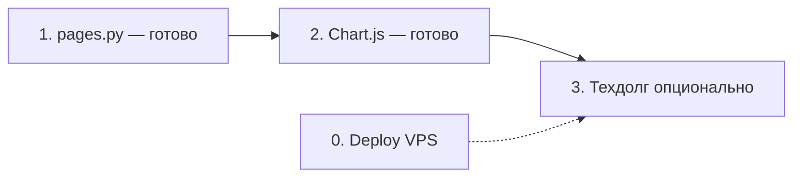

# План работ для субагентов

**Обновлено:** 04.06.2026  
**Как пользоваться:** копируй блок «Промпт субагенту» целиком в отдельный чат/агента. Один шаг = один запуск. После каждого шага: `pytest tests/` → commit → deploy по [NPM_PROXY.md](./NPM_PROXY.md).

**Текущий фокус:** шаги 1–3 закрыты. Следующее по приоритету: **шаг 0** (Deploy VPS), если main ещё не на сервере.

---

## Отменено (не делать)

| Было в ROADMAP | Причина |
|----------------|---------|
| Экспорт PDF / milestone | Достаточно `.md` на `/stats` (`/api/career/export`) |
| Топ-3 достижения на дашборде | Не нужно |
| Излишек месяца → фин. цели | Не релевантно |
| Напоминания бота 15/30 мин | Не релевантно |
| Inline mode `@bot` | Вне scope (не запрашивалось) |

---

## Очередь (порядок важен)



---

## Шаг 0 — Commit + Deploy на VPS

**Цель:** Выкатить текущий main на сервер (auth, Chart.js `/finance`, recurring_schedule, NPM, docs).

**Готово в репо, но может быть не на сервере:**
- `app/auth.py`, `app/middleware/`, `app/web/auth_routes.py`, `login.html`
- `app/services/recurring_schedule.py`
- `app/web/routes/finance.py` + `templates/partials/finance_expense_chart.html` (диаграмма)
- `docker-compose.yml` (без `:8000` наружу)
- `docs/AUTH.md`, `docs/NPM_PROXY.md`, обновлённые HANDOVER/README/ROADMAP

**Чеклист VPS:**
1. `git pull` на `/opt/projects/planner`
2. `.env`: `API_TOKEN`, `TELEGRAM_ADMIN_CHAT_ID`
3. `docker compose up -d --build` + `docker image prune -f`
4. NPM: Forward `task_planner:8000`, SSL
5. Открыть `https://домен/login`, проверить дашборд и `/finance` (диаграмма при наличии трат)
6. `docker exec task_planner curl -s http://127.0.0.1:8000/api/health`
7. Снаружи `:8000` закрыт

**Критерий готовности:** вход по cookie, бот и задачи на месте, **99** тестов в репо.

### Промпт субагенту

```
Задача: задеплоить текущий main ветки plan на VPS по docs/NPM_PROXY.md и docs/AUTH.md.
Не менять код, только: проверить uncommitted changes, при необходимости помочь с commit message,
пошагово SSH/deploy, проверить health, /login и /finance.
Путь на сервере: /opt/projects/planner, IP 91.186.217.66.
```

---

## ~~Шаг 1~~ — Разрезать `app/web/pages.py` ✅ (04.06.2026)

**Статус:** выполнено. Монолит → `app/web/pages.py` (~35 строк, сборка роутеров) + `app/web/deps.py` + `app/web/routes/*.py`.

**Фактическая структура** (см. [HANDOVER.md](../HANDOVER.md#веб-слой-htmx)):

| Модуль | Маршруты |
|--------|----------|
| `routes/dashboard.py` | `/` |
| `routes/tasks.py` | `/tasks/*` (без backlog) |
| `routes/backlog.py` | `/backlog/*` |
| `routes/calendar.py` | `/calendar`, `POST /api/calendar/{id}/decline` |
| `routes/categories.py` | `/categories/*`, quick-create API |
| `routes/archive.py` | `/archive/*` |
| `routes/stats.py` | `/stats`, AI chart/feedback |
| `routes/recurring.py` | `/recurring` |
| `routes/shopping.py` | `/shopping`, `/api/shopping/*` |
| `routes/career.py` | milestones, `/api/career/export` |
| `routes/finance.py` | `/finance`, `/finance/create`, категория tx API |

**Контракты без изменений:** `app/main.py` → `from app.web.pages import router`; `app/api/recurring.py` → `get_today_stats` re-export из `pages`. URL и HTMX — как до рефактора.

**Не поручать субагентам** — шаг закрыт.

---

## ~~Шаг 2~~ — Chart.js: расходы по категориям на `/finance` ✅ (04.06.2026)

**Статус:** выполнено.

**Реализация:**
- `app/web/routes/finance.py` — `category_summary`, `chart_expense_total` из `grouped_summary` (только расходы `amount > 0`)
- `app/web/templates/partials/finance_expense_chart.html` — doughnut + HTML-легенда (₽ и %)
- `app/web/templates/finance.html` — Chart.js 4.4.1 CDN в `extra_scripts`, пустой месяц → `#finance-chart-empty`
- `tests/test_finance.py` — рендер, пустое состояние, месяц с данными

**Не поручать субагентам** — шаг закрыт.

---

## ~~Шаг 3~~ — Alembic + бэкап SQLite ✅ (04.06.2026)

**Статус:** выполнено.

- `alembic/` + `001_baseline`, `002_legacy_schema` (идемпотентные исторические ALTER)
- `init_db`: `create_all` + PRAGMA + `run_migrations()`; без silent `ALTER` в `database.py`
- `backup_service.py`: `sqlite3.Connection.backup()`
- HANDOVER: разделы «Миграции» и «Бэкап SQLite»

**Не поручать субагентам** — шаг закрыт.

---

## Справка: что уже сделано (не поручать субагентам)

- [x] Auth API_TOKEN + middleware + `/login` cookie
- [x] NPM docs, порт 8000 закрыт
- [x] `recurring_schedule.py`
- [x] n8n удалён
- [x] **Веб-роуты:** `pages.py` + `app/web/routes/*` + `deps.py`
- [x] **Chart.js** на `/finance` (doughnut расходов по категориям)
- [x] 97+ тестов (`pytest tests/`)
- [x] **Alembic** + **бэкап** `sqlite3.backup`

---

## Шаблон запроса к субагенту (универсальный)

```
Проект: /Users/vera/Desktop/личные_доки/СLI/plan
Выполни только «Шаг N» из docs/SUBAGENT_PLAN.md (сейчас: 0 Deploy или 3 техдолг — только если Vera указала).
Перед стартом прочитай HANDOVER.md и docs/ROADMAP.md. Веб-роуты — app/web/routes/, не pages.py.
Правила: pytest tests/ в конце; не расширять scope; русский commit message по желанию Vera.
Не коммитить .env. После кода — краткий чеклист проверки для Vera.
```
