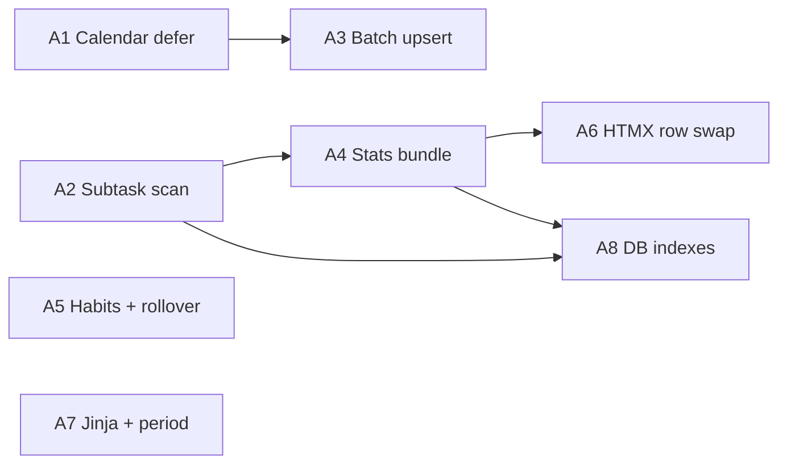

# Planner Performance Optimization Plan

> **For agentic workers:** REQUIRED SUB-SKILL: Use superpowers:subagent-driven-development (recommended) or superpowers:executing-plans to implement this plan task-by-task. Steps use checkbox (`- [ ]`) syntax for tracking.

**Goal:** Убрать «лютые» тормоза планера на hot path (дашборд + HTMX-действия с задачами) без регрессий в stats, баннере нагрузки и календаре.

**Architecture:** Три слоя оптимизации: (1) убрать blocking I/O с page load — календарь только из кэша БД + cron/ручной refresh; (2) дедуплицировать SQL на дашборде — один bundle stats за проход; (3) сузить HTMX swap до row-level вместо full-list re-render. Индексы и SQL-фильтры — отдельный PR после измеримого выигрыша от P0–P1.

**Tech Stack:** FastAPI, Jinja2, HTMX, SQLAlchemy async (SQLite), pytest + httpx AsyncClient, APScheduler

**Source review:** code-review session 2026-07-20 (dashboard load + HTMX cascade analysis)

---

## Agent assignment matrix

| Agent | Epic | Branch prefix | Depends on | Est. |
|-------|------|---------------|------------|------|
| **A1** | P0 — Calendar defer | `perf/calendar-defer` | — | 1–2h |
| **A2** | P0 — Subtask scan fix | `perf/subtask-scan` | — | 1h |
| **A3** | P1 — Calendar batch upsert | `perf/calendar-batch` | A1 merged (optional) | 2–3h |
| **A4** | P1 — Dashboard stats bundle | `perf/stats-bundle` | A2 merged | 3–4h |
| **A5** | P1 — Habits batch + rollover | `perf/dashboard-reads` | — | 1–2h |
| **A6** | P2 — HTMX row swap | `perf/htmx-row-swap` | A4 merged | 3–4h |
| **A7** | P2 — Jinja cache + period window | `perf/template-cache` | — | 1–2h |
| **A8** | P3 — DB indexes + date ranges | `perf/db-indexes` | A2, A4 | 2–3h |

**Parallel start:** A1, A2, A5, A7 — независимы, можно 4 агента одновременно.

**Merge order:** A2 → A4 → A6 → A8; A1 → A3; A5, A7 — anytime.

---

## Dependency graph



---

## File map

| File | Responsibility after plan |
|------|---------------------------|
| `app/web/templates/dashboard.html` | Убрать auto-sync; кнопка «Обновить календарь» |
| `app/web/routes/calendar.py` | `sync=False` по умолчанию; отдельный sync endpoint |
| `app/services/calendar_sync_service.py` | Batch upsert; preload existing uids |
| `app/web/deps.py` | `_today_roots_with_sub_completions` с date filter; `get_dashboard_day_bundle()` |
| `app/web/routes/dashboard.py` | Один bundle вместо 6 stats-вызовов; batch habits; без rollover |
| `app/web/routes/tasks.py` | Row-level HTMX для complete/delete root tasks |
| `app/web/templates/partials/task_card.html` | Обёртка `#task-{id}` для targeted swap |
| `app/api/habits.py` | `load_habit_logs_for_dashboard(db, habits)` — batch |
| `app/services/rollover_service.py` | Без изменений логики; убрать вызов с GET `/` |
| `alembic/versions/009_perf_indexes.py` | Composite index tasks + habit_log index |
| `tests/test_dashboard_performance.py` | Новые perf/regression тесты |
| `tests/test_calendar_sync.py` | Batch upsert + no auto-sync |

---

## Global verification (после каждого PR)

```bash
cd /Users/vera/Desktop/личные_доки/СLI/plan
pytest tests/test_today_load_banner.py tests/test_subtask_progress.py tests/test_web_pages.py -q
pytest tests/ -q
```

**Manual smoke:**
1. `GET /` — страница открывается < 500ms локально (без сети CalDAV)
2. DevTools Network: **нет** `POST /api/calendar/sync` на load
3. Complete задачи — ответ < 200ms, счётчик OOB обновляется
4. Баннер «Сегодня N задач» — те же числа до/после (сравнить с текущим main)

---

# Epic A1 — P0: Calendar defer (Agent A1)

**Branch:** `perf/calendar-defer`

**Problem:** `dashboard.html:318-323` триггерит `POST /api/calendar/sync` на `load once` → CalDAV/Google fetch до 45s.

### Task A1.1: Remove auto-sync from dashboard template

**Files:**
- Modify: `app/web/templates/dashboard.html:318-323`
- Modify: `app/web/templates/partials/calendar_column_blocks.html` (добавить кнопку refresh)
- Modify: `app/web/routes/calendar.py`

- [ ] **Step 1: Write failing test**

Create `tests/test_dashboard_performance.py`:

```python
import pytest
from httpx import AsyncClient


@pytest.mark.asyncio
async def test_dashboard_html_does_not_auto_sync_calendar(client: AsyncClient, monkeypatch):
    """На load дашборда не должно быть hx-post calendar sync."""
    called = {"sync": False}

    async def fake_refresh(*args, **kwargs):
        called["sync"] = True
        return {"upserted": 0}

    monkeypatch.setattr(
        "app.services.calendar_sync_service.refresh_calendar_events",
        fake_refresh,
    )

    resp = await client.get("/")
    assert resp.status_code == 200
    html = resp.text
    assert 'hx-post="/api/calendar/sync"' not in html or 'hx-trigger="load' not in html
    assert called["sync"] is False
```

- [ ] **Step 2: Run test — expect FAIL**

```bash
pytest tests/test_dashboard_performance.py::test_dashboard_html_does_not_auto_sync_calendar -v
```

- [ ] **Step 3: Remove hidden auto-sync div**

Delete block in `dashboard.html`:

```html
<!-- REMOVE THIS ENTIRE BLOCK -->
<div class="order-20 lg:order-none hidden"
     hx-post="/api/calendar/sync"
     hx-trigger="load once"
     ...></div>
```

Add manual refresh button in `calendar_column_blocks.html`:

```html
<button type="button"
        class="text-xs text-gray-500 hover:text-amber-500"
        hx-post="/api/calendar/sync"
        hx-target="#calendar-column-blocks"
        hx-swap="outerHTML"
        hx-indicator="#calendar-sync-spinner">
  ↻ Обновить
</button>
<span id="calendar-sync-spinner" class="htmx-indicator text-xs text-gray-600">синк…</span>
```

- [ ] **Step 4: Run test — expect PASS**

- [ ] **Step 5: Commit**

```bash
git add app/web/templates/dashboard.html app/web/templates/partials/calendar_column_blocks.html tests/test_dashboard_performance.py
git commit -m "perf(dashboard): убрать автосинк календаря на page load"
```

**Acceptance:** Dashboard показывает события из БД сразу; sync только по кнопке или APScheduler (30 min).

---

# Epic A2 — P0: Subtask scan fix (Agent A2)

**Branch:** `perf/subtask-scan`

**Problem:** `_today_roots_with_sub_completions` грузит ВСЕ выполненные подзадачи (`deps.py:444-450`).

### Task A2.1: Date-bounded subtask query

**Files:**
- Modify: `app/web/deps.py:438-465`
- Test: `tests/test_dashboard_performance.py`

- [ ] **Step 1: Write failing perf/regression test**

```python
from datetime import date, datetime, timedelta, timezone

import pytest
from sqlalchemy import select

from app.models.task import Task
from app.web.deps import _today_roots_with_sub_completions


@pytest.mark.asyncio
async def test_today_roots_ignores_old_completed_subtasks(db):
    """Родитель не подтягивается из подзадачи, закрытой месяц назад."""
    today = date.today()
    old = datetime.now(timezone.utc) - timedelta(days=30)

    parent = Task(title="Old parent", due_date=today - timedelta(days=30), status="новая", source="web")
    db.add(parent)
    await db.flush()

    db.add(Task(
        title="Old sub",
        parent_task_id=parent.id,
        status="выполнена",
        completed_at=old,
        source="web",
    ))
    # Seed noise: 50 old completed subs on other parents
    for i in range(50):
        p = Task(title=f"P{i}", due_date=today - timedelta(days=60), status="новая", source="web")
        db.add(p)
        await db.flush()
        db.add(Task(
            title=f"S{i}",
            parent_task_id=p.id,
            status="выполнена",
            completed_at=old,
            source="web",
        ))
    await db.commit()

    roots = await _today_roots_with_sub_completions(db, today)
    root_ids = {r.id for r in roots}
    assert parent.id not in root_ids


@pytest.mark.asyncio
async def test_today_roots_includes_sub_completed_today(db):
    today = date.today()
    parent = Task(title="Parent", due_date=today, status="новая", source="web")
    db.add(parent)
    await db.flush()
    db.add(Task(
        title="Sub today",
        parent_task_id=parent.id,
        status="выполнена",
        completed_at=datetime.now(timezone.utc),
        source="web",
    ))
    await db.commit()

    roots = await _today_roots_with_sub_completions(db, today)
    assert parent.id in {r.id for r in roots}
```

- [ ] **Step 2: Run — old test may pass, new old-sub test FAILS if parent wrongly included OR perf unchanged**

- [ ] **Step 3: Implement date filter in SQL**

Replace unbounded query in `_today_roots_with_sub_completions`:

```python
from datetime import datetime, time, timezone

def _utc_day_bounds(day: date) -> tuple[datetime, datetime]:
    """Локальный календарный день → UTC bounds для SQL filter."""
    local_start = datetime.combine(day, time.min).astimezone()
    local_end = datetime.combine(day, time.max).astimezone()
    start_utc = local_start.astimezone(timezone.utc)
    end_utc = local_end.astimezone(timezone.utc)
    return start_utc, end_utc


async def _today_roots_with_sub_completions(db: AsyncSession, today: date) -> list[Task]:
    roots_result = await db.execute(select(Task).where(*_today_roots_filter(today)))
    roots = list(roots_result.scalars().all())
    seen = {r.id for r in roots}

    start_utc, end_utc = _utc_day_bounds(today)
    extra_result = await db.execute(
        select(Task.parent_task_id)
        .where(
            Task.parent_task_id.isnot(None),
            Task.status == "выполнена",
            Task.completed_at.isnot(None),
            Task.completed_at >= start_utc,
            Task.completed_at <= end_utc,
        )
        .distinct()
    )
    extra_parent_ids = {pid for (pid,) in extra_result.all() if pid}

    if extra_parent_ids:
        extra_roots_result = await db.execute(
            select(Task).where(Task.id.in_(extra_parent_ids))
        )
        for parent in extra_roots_result.scalars().all():
            if parent.id not in seen:
                roots.append(parent)
                seen.add(parent.id)

    return roots
```

- [ ] **Step 4: Run full banner tests**

```bash
pytest tests/test_today_load_banner.py tests/test_dashboard_performance.py -v
```

- [ ] **Step 5: Commit**

```bash
git commit -m "perf(stats): ограничить скан подзадач календарным днём"
```

**Acceptance:** `test_today_load_banner.py` — все green; `_today_roots_with_sub_completions` не читает subs старше today.

---

# Epic A3 — P1: Calendar batch upsert (Agent A3)

**Branch:** `perf/calendar-batch`

**Depends on:** A1 (optional — можно параллельно)

### Task A3.1: Preload + bulk upsert

**Files:**
- Modify: `app/services/calendar_sync_service.py:123-186`
- Test: `tests/test_calendar_sync.py` (create if missing)

- [ ] **Step 1: Test — sync N events = bounded queries**

```python
@pytest.mark.asyncio
async def test_sync_calendar_batch_not_n_plus_one(db, monkeypatch):
    from app.services.calendar_sync_service import sync_calendar_events

    rows = [
        {
            "external_uid": f"uid-{i}",
            "title": f"Event {i}",
            "start_at": datetime.now(),
            "end_at": None,
            "location": "",
            "calendar_name": "work",
            "calendar_url": "",
            "is_recurring": False,
            "is_all_day": False,
            "calendar_source": "test",
            "calendar_kind": "work",
            "recurrence_id": None,
        }
        for i in range(20)
    ]

    async def fake_fetch():
        return rows

    monkeypatch.setattr(
        "app.services.calendar_sync_service._fetch_all_provider_rows",
        fake_fetch,
    )
    monkeypatch.setattr(
        "app.services.calendar_sync_service._calendar_sync_active",
        lambda: True,
    )

    result = await sync_calendar_events()
    assert result.get("upserted", 0) == 20
```

- [ ] **Step 2: Implement preload**

```python
# Before loop:
uids = [row["external_uid"] for row in rows]
existing_map: dict[str, CalendarEvent] = {}
if uids:
    existing_result = await db.execute(
        select(CalendarEvent).where(CalendarEvent.external_uid.in_(uids))
    )
    for ev in existing_result.scalars().all():
        existing_map[ev.external_uid] = ev

# In loop:
ev = existing_map.get(uid)
# ... same update/insert logic, no per-row SELECT
```

- [ ] **Step 3: Run tests + commit**

```bash
git commit -m "perf(calendar): batch preload для upsert без N+1"
```

---

# Epic A4 — P1: Dashboard stats bundle (Agent A4)

**Branch:** `perf/stats-bundle`

**Depends on:** A2 merged

**Problem:** `get_today_stats`, `get_subtask_today_progress`, `build_daily_load_warning` — тройной проход по roots/subs/recurring.

### Task A4.1: Introduce `DashboardDayStats` dataclass

**Files:**
- Modify: `app/web/deps.py`
- Modify: `app/web/routes/dashboard.py:129-162`
- Test: `tests/test_dashboard_performance.py`

- [ ] **Step 1: Define bundle + failing test**

```python
from dataclasses import dataclass


@dataclass
class DashboardDayStats:
    completed: int
    total: int
    subtask_progress: dict
    ai_warning: str | None
    recurring_today: list


async def get_dashboard_day_stats(db: AsyncSession, today: date | None = None) -> DashboardDayStats:
    """Единый проход: standalone + subtask + recurring + banner."""
    ...
```

Test: monkeypatch/spy — один вызов `load_active_recurring_templates` на bundle (use `unittest.mock` wrap).

- [ ] **Step 2: Implement single-pass logic**

Algorithm:
1. Load roots once (`_today_roots_filter`)
2. Load ALL subs for root_ids once
3. Load recurring templates once + completed_keys once
4. Compute: standalone progress, subtask progress, actionable counts for banner
5. Call `get_avg_completed_per_day` only if remaining > 8

- [ ] **Step 3: Wire dashboard.py**

Replace lines 125-162:

```python
from app.web.deps import get_dashboard_day_stats

bundle = await get_dashboard_day_stats(db, today)
recurring_today = bundle.recurring_today
completed, total = bundle.completed, bundle.total
subtask_progress = bundle.subtask_progress
ai_warning = bundle.ai_warning
```

Keep `get_today_stats`, `get_subtask_today_progress`, `build_daily_load_warning` as thin wrappers delegating to bundle (backward compat for HTMX).

- [ ] **Step 4: Refactor `append_today_stats_oob` to use bundle**

```python
async def append_today_stats_oob(content: str, db: AsyncSession) -> str:
    bundle = await get_dashboard_day_stats(db)
    return (
        content
        + today_stats_oob_html(bundle.completed, bundle.total)
        + today_subtask_stats_oob_html(bundle.subtask_progress)
        + (ai_warning_oob_from(bundle.ai_warning))
    )
```

- [ ] **Step 5: Run all stats tests**

```bash
pytest tests/test_today_load_banner.py tests/test_subtask_progress.py -v
git commit -m "perf(dashboard): единый bundle stats вместо каскада запросов"
```

---

# Epic A5 — P1: Habits batch + remove rollover (Agent A5)

**Branch:** `perf/dashboard-reads`

### Task A5.1: Batch habit logs

**Files:**
- Modify: `app/api/habits.py` — add `load_habit_logs_map(db, habits) -> dict[int, set[str]]`
- Modify: `app/web/routes/dashboard.py:63-92`

- [ ] **Step 1: Implement batch query**

```python
async def load_habit_logs_map(db: AsyncSession, habits: list[Habit]) -> dict[int, set[str]]:
    if not habits:
        return {}
    habit_ids = [h.id for h in habits]
    result = await db.execute(
        select(HabitLog.habit_id, HabitLog.date).where(
            HabitLog.habit_id.in_(habit_ids),
            HabitLog.cycle_number.in_({h.current_cycle for h in habits}),
        )
    )
    out: dict[int, set[str]] = defaultdict(set)
    for habit_id, log_date in result.all():
        out[habit_id].add(log_date.isoformat())
    return out
```

Note: cycle filter — либо два запроса по группам cycle, либо `(habit_id, cycle_number) IN (...)` tuple list.

- [ ] **Step 2: Replace N+1 loop in dashboard.py**

- [ ] **Step 3: Test — 5 habits = 2 queries max** (habits + logs)

### Task A5.2: Remove rollover from GET `/`

**Files:**
- Modify: `app/web/routes/dashboard.py:51-55`

- [ ] **Step 1: Delete rollover call from dashboard**

Rollover stays in: `main.py` startup + cron 00:10.

- [ ] **Step 2: Test dashboard still loads**

```bash
pytest tests/test_web_pages.py -v -k dashboard
git commit -m "perf(dashboard): batch habit logs, убрать rollover с GET /"
```

---

# Epic A6 — P2: HTMX row-level swap (Agent A6)

**Branch:** `perf/htmx-row-swap`

**Depends on:** A4 (stats bundle уже быстрый)

**Problem:** `complete_task` → `get_tasks_today()` re-render всего списка.

### Task A6.1: Root task row partial

**Files:**
- Create: `app/web/templates/partials/task_card_oob.html` (или reuse `task_card.html`)
- Modify: `app/web/routes/tasks.py:430-470`
- Modify: `app/web/templates/partials/tasks_list_split.html`

- [ ] **Step 1: Ensure each root task wrapped in `#task-{id}`**

Verify `task_card.html` has `id="task-{{ task.id }}"`.

- [ ] **Step 2: On complete — return empty + OOB hide OR swap single card**

Pattern (как subtask_row):

```python
# complete_task for root on dashboard:
if not is_backlog and target != "task-*":
    task.status = "выполнена"
    ...
    await db.commit()
    hide = f'<div id="task-{task.id}" hx-swap-oob="true"></div>'
    return HTMLResponse(content=await append_today_stats_oob(hide, db))
```

For uncomplete/reopen flows — return rendered card OOB.

- [ ] **Step 3: HTMX test**

```python
@pytest.mark.asyncio
async def test_complete_task_returns_oob_not_full_list(client, db):
    # seed task, POST complete, assert "tasks-list-split" not in response
    # assert 'hx-swap-oob' in response.text
```

- [ ] **Step 4: Audit all `get_tasks_today` call sites in tasks.py**

Only use full list for: create task, reorder — not complete/delete.

```bash
git commit -m "perf(htmx): row-level swap при complete/delete root task"
```

---

# Epic A7 — P2: Jinja cache + period window (Agent A7)

**Branch:** `perf/template-cache`

### Task A7.1: Re-enable Jinja cache

**Files:**
- Modify: `app/web/deps.py:288`

- [ ] **Step 1: Remove `templates.env.cache = None`**

- [ ] **Step 2: If unhashable dict error — fix template**

Likely culprit: passing mutable dict as macro default. Fix in specific template, not global disable.

- [ ] **Step 3: Smoke render all partials**

### Task A7.2: Period entries window

**Files:**
- Modify: `app/web/routes/dashboard.py:96-98`
- Modify: `app/web/deps.py:compute_period_data` if needed

- [ ] **Step 1: Limit to 120 days**

```python
window_start = today - timedelta(days=120)
period_result = await db.execute(
    select(PeriodEntry)
    .where(PeriodEntry.date >= window_start)
    .order_by(PeriodEntry.date)
)
```

- [ ] **Step 2: Test period UI still works**

```bash
git commit -m "perf: jinja cache + period entries window 120d"
```

---

# Epic A8 — P3: DB indexes + date ranges (Agent A8)

**Branch:** `perf/db-indexes`

**Depends on:** A2, A4

### Task A8.1: Alembic composite indexes

**Files:**
- Create: `alembic/versions/009_perf_indexes.py`

```python
def upgrade():
    op.create_index(
        "ix_tasks_dashboard_day",
        "tasks",
        ["due_date", "is_archived", "parent_task_id", "status"],
    )
    op.create_index("ix_habit_logs_habit_cycle", "habit_logs", ["habit_id", "cycle_number"])
    op.create_index("ix_tasks_completed_at", "tasks", ["completed_at"])
```

### Task A8.2: Replace `func.date(completed_at)` in hot paths

**Files:**
- Modify: `app/web/deps.py` — `_today_roots_filter`, `count_completed_tasks`

Use UTC bounds helper from A2 instead of `func.date()`.

- [ ] **Run migrations test**

```bash
pytest tests/test_migrations.py -v
git commit -m "perf(db): composite indexes + range filters на completed_at"
```

---

# PR checklist (для ревьюера)

- [ ] `pytest tests/ -q` green
- [ ] Нет `POST /api/calendar/sync` на dashboard load
- [ ] `test_today_load_banner.py` — числа баннера не изменились
- [ ] Complete task — не re-render всего `#tasks-list`
- [ ] Rollover работает via cron (не сломан в `main.py`)
- [ ] CHANGELOG.md — секция Performance

---

# Rollback plan

| Epic | Rollback |
|------|----------|
| A1 | Вернуть hidden hx-trigger div |
| A2 | Revert `_today_roots_with_sub_completions` |
| A4 | Wrappers → old functions |
| A6 | Revert to `get_tasks_today` on complete |
| A8 | `alembic downgrade -1` |

---

# Expected impact

| Metric | Before (est.) | After P0+P1 |
|--------|---------------|-------------|
| Dashboard TTFB (with calendar) | 2–45s | < 300ms |
| SQL queries on GET `/` | 20–40 | 8–12 |
| HTMX complete task | 15+ queries + full render | 3–5 queries + OOB |
| Subtask scan rows | ALL completed subs | ~today only |

---

# Execution handoff

**Plan saved to:** `docs/superpowers/plans/2026-07-20-planner-performance.md`

**Recommended dispatch order:**
1. **Wave 1 (parallel):** A1, A2, A5, A7
2. **Wave 2:** A3, A4
3. **Wave 3:** A6, A8

**Per-agent prompt template:**

```
Implement Epic {AX} from docs/superpowers/plans/2026-07-20-planner-performance.md
Branch: perf/...
Do NOT touch other epics. Run verification commands from plan. Commit per task.
```
